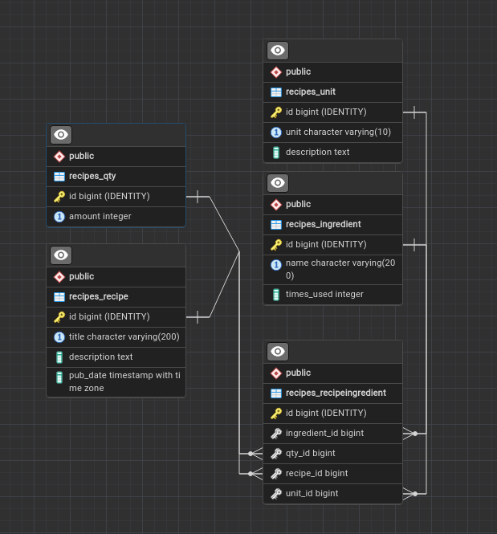
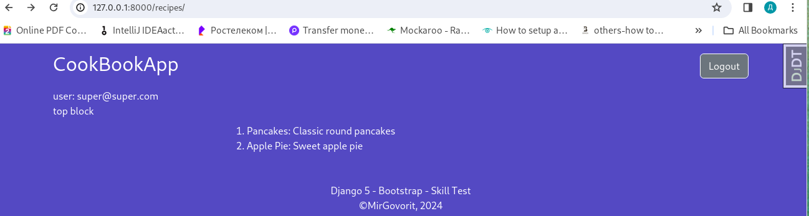

# cookbook app: simple recipes organizer
## База данных
Схема БД - 5 таблиц:

рецепты, продукты, количество, единицы измерения, ингредиенты. 

[](images/img_01.png)

Название продукта дополнено целочисленным полем, подсчитывающим количество приготовлений. 
Продукт в рецепте используется только один раз.

## Функционал

[](images/img_02.png)
[](images/img_03.png)
[](images/img_04.png)

Показан список рецептов, детализированный просмотр рецепта, 
список рецептов, в которых отсутствует заданный продукт, в табличной форме.

По GET - запросу на /recipes/add_product/1/2/100/ml функция  add_product_to_recipe 
добавляет продукт к рецепту или изменяет его количество в рецепте, если он там уже есть.

По GET - запросу на /recipes/cook_recipe/1 функция  cook_recipe увеличивает на единицу 
количество приготовлений для каждого продукта, входящего в указанный рецепт.

По GET - запросу на /recipes/without_product/1 функция show_recipes_without_product возвращает HTML-страницу
с таблицей рецептов, в которые указанный продукт не входит или его количество
в рецепте менее 10 грамм. Запрос выполнен с помощью отрицательной маски.
```code python
q = Q(id__in=recipes_with_product_ids)
negative_query_recipes = Recipe.objects.filter(~q)
```

Взаимодействие с БД оптимизировано с помощью select_related()
```code python
positive_query = (
        RecipeIngredient.objects
        .select_related("recipe", "unit", "qty", "ingredient")
        .filter(q)
    )
```

## Django race condition

Для сохранения целостности данных в при условии одновременного доступа пользователей к таблице применены
select_for_update
```code python
RecipeIngredient.objects.select_for_update().get(q)
```
а в случае применения операции инкремента значения F():
```code python
Ingredient.objects.filter(id=i.ingredient.id).update(times_used=F("times_used") + 1)
```
## Администрирование

Выполнена настройка страницы администрирования для внесения изменений в БД.
Изменен заголовок страницы администрирования.

```code python
class RecipeAdmin(admin.ModelAdmin):
    fieldsets = [
        ("RECIPE", {"fields": ["title", "description"]}),
        ("DATE INFORMATION", {"fields": ["pub_date"]}),
    ]
    list_display = ["title", "pub_date", "was_published_recently"]
    list_filter = ['pub_date']
    search_fields = ["title"]
    inlines = [RecipeIngredientsInline]
```
[](images/img_05.png)
[](images/img_06.png)
[](images/img_07.png)

## Тестирование

Приложение содержит модульные тесты для проверки моделей, вьюшек и функций.

[](images/img_08.png)
[](images/img_09.png)
[](images/img_10.png)

Функционал ТЗ проверен на:
- добавление нового продукта в рецепт
- изменение веса продукта
- валидацию отсутствия рецепта, единиц веса или объема, внесенного в БД числового значения (количества), продукта
- "приготовление рецепта" с операцией инкремента в БД
- запрос рецептов, в которых продукт не присутствует


Приложение содержит кастомизированный модуль авторизации по email.
В работе приложения он не используется, но готов к применению.
CI, pylint не применялись, для add_product_to_recipe нужен рефакторинг с выделением валидации данных в отдельный фрагмент.